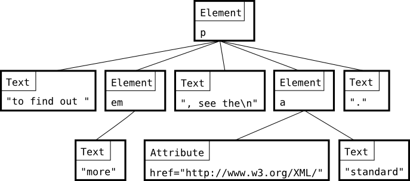

# XmlDifference

[](https://github.com/jkone27/xdiff/actions/workflows/dotnet.yml)



A simple fsharp xml diff that you can call from C#

```csharp

//workaround for F# limitation in extension methods..
using static XmlDifference.DiffExtensions.DifferenceExtension;

var diffs = "A.xml".Difference("B.xml");
foreach (var d in diffs)
    Console.WriteLine(d);
```

[](https://github.com/jkone27/AliceMQ/issues)
